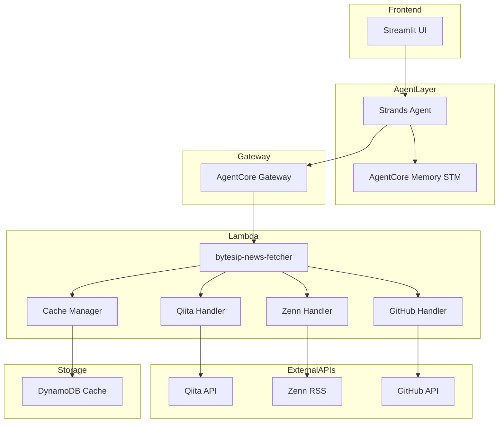
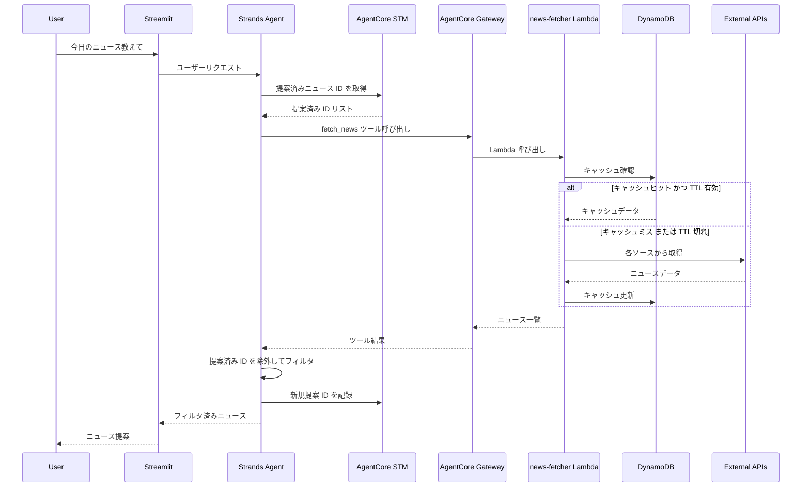
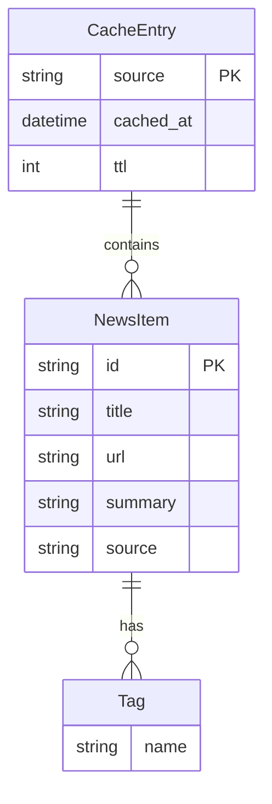
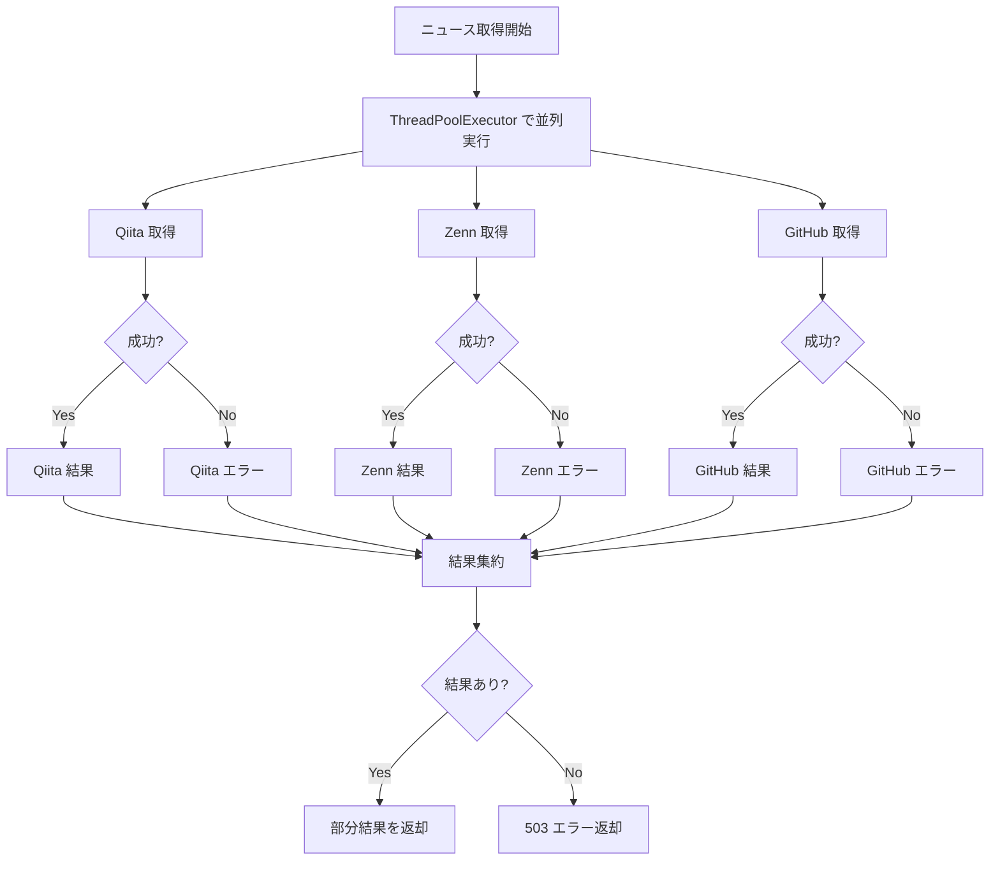

# Technical Design Document

## Overview

**Purpose**: ByteSip は IT/AI ニュースを一口サイズでエンジニアに届ける AI エージェントである。Qiita・Zenn・GitHub から最新情報を取得し、フィルタリング・重複排除を行った上でユーザーに提案する。

**Users**: 日本語を使用するエンジニアが、朝のコーヒータイムに効率的にテック情報をキャッチアップするために利用する。

**Impact**: 新規開発（greenfield）。既存システムへの影響なし。

### Goals
- Qiita・Zenn・GitHub から最新ニュースを取得し提案する
- ソース指定・件数指定・技術タグによるフィルタリングを実現する
- セッション内での重複排除により、常に新しい情報を提供する
- 外部 API 障害時も Graceful Degradation で部分的にサービスを継続する

### Non-Goals
- 期間指定検索（MVP2）
- 記事の深掘り機能（MVP2）
- ブックマーク機能（MVP2）
- A2A プロトコル対応（本番フェーズ）
- ユーザー嗜好の長期学習（LTM は将来検討）

## Architecture

### Architecture Pattern & Boundary Map

**Selected Pattern**: Modular Monolith（単一 Lambda + モジュール分割）

**Rationale**: MVP ではシンプルさを優先。3 つの外部ソース（Qiita/Zenn/GitHub）を単一 Lambda 内でハンドラーモジュールとして分割し、管理性を確保しつつ複雑性を抑える。各ソースへの API 呼び出しは `concurrent.futures.ThreadPoolExecutor` で並列実行し、レスポンス時間を最小化する。



**Domain Boundaries**:
- **Presentation Layer**: Streamlit UI（開発用）
- **Agent Layer**: Strands Agent + AgentCore Memory（会話・記憶管理）
- **Gateway Layer**: AgentCore Gateway（ツール呼び出し仲介）
- **Service Layer**: Lambda 関数（ビジネスロジック）
- **Data Layer**: DynamoDB（キャッシュ）

**Steering Compliance**: docs/requirements.md に記載のアーキテクチャに準拠

### Technology Stack

| Layer | Choice / Version | Role in Feature | Notes |
|-------|------------------|-----------------|-------|
| Frontend | Streamlit | 開発用 Web UI | MVP 用。本番は A2A に移行予定 |
| Agent Framework | Strands Agents SDK (Python 3.10+) | エージェント構築 | BedrockModel 使用 |
| Agent Infrastructure | Amazon Bedrock AgentCore | Runtime, Gateway, Memory | STM で重複排除 |
| Agent Deployment | bedrock-agentcore-starter-toolkit | CLI でのエージェントデプロイ | `agentcore deploy` |
| Backend | AWS Lambda (Python 3.12) | ニュース取得ロジック | 単一関数で全ソース対応 |
| Infrastructure as Code | AWS CDK (Python) | Lambda, DynamoDB のプロビジョニング | TypeScript 不要 |
| Data / Cache | Amazon DynamoDB | 外部 API 結果のキャッシュ | TTL: 1日、最大 90 件 |
| External APIs | Qiita API v2, Zenn RSS, GitHub Search API | ニュースソース | Rate Limit 考慮 |

### Deployment Architecture

```
┌─────────────────────────────────────────────────────────────────┐
│                    Deployment Pipeline                          │
├─────────────────────────────────────────────────────────────────┤
│                                                                 │
│  ┌─────────────────────┐     ┌─────────────────────────────┐  │
│  │  AWS CDK            │     │  agentcore-starter-toolkit  │  │
│  │  (infrastructure/)  │     │  (agent/)                   │  │
│  ├─────────────────────┤     ├─────────────────────────────┤  │
│  │ • DynamoDB Table    │     │ • Strands Agent             │  │
│  │ • Lambda Function   │     │ • AgentCore Memory (STM)    │  │
│  │ • SSM Parameters    │     │ • AgentCore Gateway         │  │
│  │ • IAM Roles         │     │   (Lambda 連携)             │  │
│  └─────────────────────┘     └─────────────────────────────┘  │
│         │                              │                       │
│         ▼                              ▼                       │
│  ┌─────────────────────┐     ┌─────────────────────────────┐  │
│  │  cdk deploy         │     │  agentcore deploy           │  │
│  └─────────────────────┘     └─────────────────────────────┘  │
│                                                                 │
└─────────────────────────────────────────────────────────────────┘
```

**デプロイ順序**:
1. `cdk deploy` で Lambda / DynamoDB / SSM をプロビジョニング
2. `agentcore configure` でエージェント設定
3. `agentcore deploy` でエージェントを AgentCore Runtime にデプロイ
4. AgentCore Gateway に Lambda ARN を登録（ツールとして利用可能に）

## System Flows

### ニュース取得フロー



**Key Decisions**:
- キャッシュファースト戦略により API 呼び出しを最小化
- 各ソースへの API 呼び出しは `ThreadPoolExecutor` で並列実行（レスポンス時間短縮）
- STM を使用してセッション内で提案済み ID を記録
- フィルタリングはエージェント側で実行（Lambda は全件返却）

## Requirements Traceability

| Requirement | Summary | Components | Interfaces | Flows |
|-------------|---------|------------|------------|-------|
| 1.1 | ニュース取得・提案 | NewsFetcher, CacheManager, StrandsAgent | FetchNewsRequest/Response | ニュース取得フロー |
| 1.2 | レスポンス形式（タイトル、URL、要約、タグ） | NewsItem 型定義 | NewsItem | - |
| 1.3 | 1回の提案上限（各10件、合計30件） | StrandsAgent | - | - |
| 1.4 | キャッシュからの取得（90件保持） | CacheManager | CacheEntry | - |
| 1.5 | キャッシュ TTL（1日） | CacheManager | DynamoDB TTL | - |
| 2.1, 2.2, 2.3 | ソース指定フィルタ | StrandsAgent | source パラメータ | - |
| 3.1, 3.2 | 件数指定 | StrandsAgent | limit パラメータ | - |
| 3.3, 3.4 | 追加提案・在庫なし応答 | StrandsAgent, STM | - | - |
| 4.1, 4.2, 4.3 | 技術タグフィルタ | StrandsAgent, SourceHandlers | tags パラメータ | - |
| 5.1, 5.2, 5.3 | 重複排除（STM 使用） | AgentCore STM | proposed_ids リスト | - |
| 6.1, 6.2, 6.3 | エラーハンドリング | SourceHandlers | ErrorResponse | - |

## Components and Interfaces

| Component | Domain/Layer | Intent | Req Coverage | Key Dependencies | Contracts |
|-----------|--------------|--------|--------------|------------------|-----------|
| StrandsAgent | Agent | ユーザー対話・フィルタ・記憶管理 | 1.1-1.3, 2.1-2.3, 3.1-3.4, 4.1-4.3, 5.1-5.3 | AgentCore Memory (P0), Gateway (P0) | Service |
| NewsFetcher | Lambda | ニュース取得オーケストレーション | 1.1, 1.4, 1.5, 6.1-6.3 | CacheManager (P0), SourceHandlers (P0) | API |
| CacheManager | Lambda | DynamoDB キャッシュ管理 | 1.4, 1.5 | DynamoDB (P0) | Service |
| QiitaHandler | Lambda | Qiita API 呼び出し | 1.1, 4.1, 4.2, 6.1, 6.2 | Qiita API (P1) | Service |
| ZennHandler | Lambda | Zenn RSS パース | 1.1, 4.1, 4.2, 6.1 | Zenn RSS (P1) | Service |
| GitHubHandler | Lambda | GitHub Search API 呼び出し | 1.1, 6.1, 6.2 | GitHub API (P1) | Service |

---

### Agent Layer

#### StrandsAgent

| Field | Detail |
|-------|--------|
| Intent | ユーザー対話を処理し、ニュースのフィルタリング・重複排除・提案を行う |
| Requirements | 1.1, 1.2, 1.3, 2.1, 2.2, 2.3, 3.1, 3.2, 3.3, 3.4, 4.1, 4.2, 4.3, 5.1, 5.2, 5.3 |

**Responsibilities & Constraints**
- ユーザーの自然言語リクエストを解析
- AgentCore Gateway 経由で fetch_news ツールを呼び出し
- STM から提案済み ID を取得し、重複を除外
- ソース・件数・タグのフィルタリングを適用
- 新規提案 ID を STM に記録

**Dependencies**
- Outbound: AgentCore Gateway — ツール呼び出し (P0)
- Outbound: AgentCore Memory STM — 提案済み ID 管理 (P0)
- Inbound: Streamlit — ユーザーリクエスト (P0)

**Contracts**: Service [x] / API [ ] / Event [ ] / Batch [ ] / State [x]

##### Service Interface

```python
from typing import Literal
from dataclasses import dataclass

@dataclass
class NewsRequest:
    sources: list[Literal["qiita", "zenn", "github"]] | None = None
    limit: int = 10
    tags: list[str] | None = None

@dataclass
class NewsItem:
    id: str  # Format: "{source}_{original_id}" (e.g., "qiita_abc123", "zenn_my-slug", "github_owner/repo")
    title: str
    url: str
    summary: str  # 各ソースから抽出（下記 Summary Generation 参照）
    tags: list[str]  # Zenn は空配列（トピック別 RSS 使用時はトピック名を設定）
    source: Literal["qiita", "zenn", "github"]

@dataclass
class NewsResponse:
    items: list[NewsItem]
    has_more: bool

class ByteSipAgent:
    def handle_request(self, user_message: str) -> NewsResponse:
        """ユーザーリクエストを処理しニュースを返却"""
        ...

    def get_proposed_ids(self) -> list[str]:
        """STM から提案済み ID を取得"""
        ...

    def record_proposed_ids(self, ids: list[str]) -> None:
        """STM に新規提案 ID を記録"""
        ...
```

- Preconditions: AgentCore Memory が初期化済み
- Postconditions: 提案したニュース ID が STM に記録される
- Invariants: 同一セッション内で同じニュースは提案されない

##### State Management
- **State model**: STM に `proposed_ids: list[str]` として保存
- **Persistence**: AgentCore Memory STM（セッション単位）
- **Concurrency**: 単一セッション内での逐次処理

---

### Lambda Layer

#### NewsFetcher

| Field | Detail |
|-------|--------|
| Intent | 外部ソースからニュースを取得し、キャッシュ管理を行う |
| Requirements | 1.1, 1.4, 1.5, 6.1, 6.2, 6.3 |

**Responsibilities & Constraints**
- AgentCore Gateway からの呼び出しを受付
- CacheManager でキャッシュ確認・更新
- 各 SourceHandler を `ThreadPoolExecutor` で並列実行しニュースを取得
- エラー発生時は成功したソースのみ返却（並列実行のため他ソースに影響しない）

**Dependencies**
- Inbound: AgentCore Gateway — ツール呼び出し (P0)
- Outbound: CacheManager — キャッシュ管理 (P0)
- Outbound: QiitaHandler, ZennHandler, GitHubHandler — ソース取得 (P0)

**Contracts**: Service [ ] / API [x] / Event [ ] / Batch [ ] / State [ ]

##### API Contract

| Method | Endpoint | Request | Response | Errors |
|--------|----------|---------|----------|--------|
| POST | Lambda Invoke | FetchNewsRequest | FetchNewsResponse | 500 (partial failure), 503 (all sources failed) |

```python
from typing import Literal
from dataclasses import dataclass

@dataclass
class FetchNewsRequest:
    sources: list[Literal["qiita", "zenn", "github"]] | None = None
    tags: list[str] | None = None
    force_refresh: bool = False

@dataclass
class FetchNewsResponse:
    items: list[NewsItem]
    errors: list[SourceError] | None = None

@dataclass
class SourceError:
    source: Literal["qiita", "zenn", "github"]
    error_type: Literal["connection_error", "rate_limit", "parse_error"]
    message: str
```

**Implementation Notes**
- Integration: AgentCore Gateway で Lambda ARN を登録
- Validation: sources が指定されない場合は全ソースを取得
- Parallelization: `concurrent.futures.ThreadPoolExecutor(max_workers=3)` で各ソースを並列取得
- Risks: 全ソースが失敗した場合は 503 を返却

---

#### CacheManager

| Field | Detail |
|-------|--------|
| Intent | DynamoDB を使用したキャッシュ管理（TTL: 1日、各ソース30件） |
| Requirements | 1.4, 1.5 |

**Responsibilities & Constraints**
- キャッシュの読み取り・書き込み
- TTL 管理（1日）
- 各ソース最大30件の制限

**Dependencies**
- Outbound: DynamoDB — キャッシュストレージ (P0)

**Contracts**: Service [x] / API [ ] / Event [ ] / Batch [ ] / State [ ]

##### Service Interface

```python
from typing import Literal
from dataclasses import dataclass

@dataclass
class CacheEntry:
    source: Literal["qiita", "zenn", "github"]
    items: list[NewsItem]
    cached_at: str  # ISO 8601
    ttl: int  # Unix timestamp

class CacheManager:
    def get(self, source: Literal["qiita", "zenn", "github"]) -> CacheEntry | None:
        """キャッシュエントリを取得。TTL 切れの場合は None"""
        ...

    def set(self, source: Literal["qiita", "zenn", "github"], items: list[NewsItem]) -> None:
        """キャッシュエントリを保存（最大30件、TTL: 1日）"""
        ...

    def invalidate(self, source: Literal["qiita", "zenn", "github"]) -> None:
        """キャッシュを無効化"""
        ...
```

- Preconditions: DynamoDB テーブルが存在
- Postconditions: TTL 内のデータが返却される
- Invariants: 各ソース最大30件を保持

---

#### QiitaHandler

| Field | Detail |
|-------|--------|
| Intent | Qiita API v2 からトレンド記事を取得 |
| Requirements | 1.1, 4.1, 4.2, 6.1, 6.2 |

**Responsibilities & Constraints**
- Qiita API v2 `/api/v2/items` を呼び出し
- Bearer トークンで認証
- タグフィルタリングをクエリパラメータで適用

**Dependencies**
- External: Qiita API v2 — 記事取得 (P1)

**Contracts**: Service [x] / API [ ] / Event [ ] / Batch [ ] / State [ ]

##### Service Interface

```python
class QiitaHandler:
    def fetch(self, tags: list[str] | None = None, limit: int = 30) -> list[NewsItem]:
        """Qiita からトレンド記事を取得"""
        ...
```

**Implementation Notes**
- Integration: 環境変数 `QIITA_ACCESS_TOKEN` で認証
- Validation: Rate Limit（1,000回/時）超過時は RateLimitError を送出
- Risks: API 障害時は空リストを返却し、SourceError を報告

---

#### ZennHandler

| Field | Detail |
|-------|--------|
| Intent | Zenn RSS フィードからトレンド記事を取得 |
| Requirements | 1.1, 6.1 |

**Responsibilities & Constraints**
- Zenn RSS (`https://zenn.dev/feed`) をパース
- feedparser ライブラリを使用
- **タグフィルタリング制限**: Zenn RSS には category/トピック情報が含まれない

**Dependencies**
- External: Zenn RSS — 記事取得 (P1)

**Contracts**: Service [x] / API [ ] / Event [ ] / Batch [ ] / State [ ]

##### Service Interface

```python
class ZennHandler:
    def fetch(self, tags: list[str] | None = None, limit: int = 30) -> list[NewsItem]:
        """Zenn RSS からトレンド記事を取得

        Args:
            tags: 指定時はトピック別 RSS を使用（例: ["python"] → /topics/python/feed）
            limit: 取得件数
        """
        ...
```

**Implementation Notes**
- Integration: feedparser で XML パース
- Validation: RSS パース失敗時は ParseError を送出
- **Tag Filtering Strategy**:
  - tags 未指定: トレンド RSS (`/feed`) を使用、`NewsItem.tags = []`
  - tags 指定: トピック別 RSS (`/topics/{tag}/feed`) を使用、`NewsItem.tags = [tag]`
  - 複数タグ指定時は最初のタグのトピック RSS を使用（Zenn の制約）
- Risks: トピック別 RSS は記事数が少ない場合がある

---

#### GitHubHandler

| Field | Detail |
|-------|--------|
| Intent | GitHub Search API からトレンドリポジトリを取得 |
| Requirements | 1.1, 6.1, 6.2 |

**Responsibilities & Constraints**
- GitHub Search API `/search/repositories` を呼び出し
- `pushed:>YYYY-MM-DD stars:>100` クエリでトレンド代替
- Personal Access Token で認証

**Dependencies**
- External: GitHub Search API — リポジトリ取得 (P1)

**Contracts**: Service [x] / API [ ] / Event [ ] / Batch [ ] / State [ ]

##### Service Interface

```python
class GitHubHandler:
    def fetch(self, limit: int = 30) -> list[NewsItem]:
        """GitHub からトレンドリポジトリを取得"""
        ...
```

**Implementation Notes**
- Integration: 環境変数 `GITHUB_ACCESS_TOKEN` で認証
- Validation: Rate Limit（30回/分）超過時は RateLimitError を送出
- Risks: 「Star 急増」の公式 API がないため、代替クエリで近似

---

## Data Models

### Domain Model



**Aggregates**:
- `CacheEntry`: ソース単位でのキャッシュ（トランザクション境界）

**Invariants**:
- 各ソースにつき最大30件の NewsItem を保持
- TTL は 24 時間（86400秒）

### ID Generation Rules

| Source | ID Format | Example |
|--------|-----------|---------|
| Qiita | `qiita_{item_id}` | `qiita_abc123def456` |
| Zenn | `zenn_{slug}` | `zenn_my-article-slug` |
| GitHub | `github_{full_name}` | `github_owner/repo-name` |

### Summary Generation

| Source | 抽出元 | 備考 |
|--------|--------|------|
| Qiita | API レスポンスの `body` 冒頭 200 文字 | Markdown をプレーンテキスト化 |
| Zenn | RSS の `description` フィールド | 記事冒頭が自動抽出される |
| GitHub | リポジトリの `description` フィールド | 未設定の場合は空文字 |

### Physical Data Model (DynamoDB)

**Table Name**: `bytesip-news-cache`

| Attribute | Type | Description |
|-----------|------|-------------|
| PK | String | `SOURCE#<source_name>` |
| SK | String | `ITEM#<item_id>` または `META` |
| title | String | ニュースタイトル |
| url | String | 元記事 URL |
| summary | String | 要約文 |
| tags | List[String] | 技術タグ配列 |
| source | String | ソース名 |
| cached_at | String | ISO 8601 タイムスタンプ |
| ttl | Number | Unix timestamp（DynamoDB TTL） |

**Access Patterns**:
1. ソース別に全件取得: `PK = SOURCE#qiita`
2. 全ソースの全件取得: Scan（MVP では許容）

**TTL Configuration**: DynamoDB TTL を `ttl` 属性で有効化

---

## Error Handling

### Error Strategy

| Error Type | Detection | Response | Recovery |
|------------|-----------|----------|----------|
| API 接続エラー | requests.ConnectionError | SourceError を含めて返却 | 他ソースは継続 |
| Rate Limit | 429 ステータス | SourceError を含めて返却 | キャッシュデータを返却 |
| RSS パースエラー | feedparser.bozo | SourceError を含めて返却 | 他ソースは継続 |
| 全ソース失敗 | 全 Handler がエラー | 503 Service Unavailable | リトライ指示 |

### Graceful Degradation（並列実行）



**Key Points**:
- 3 つのソースを同時に取得（待ち時間 = 最も遅いソースの応答時間）
- 1 つのソースがエラーでも他のソースには影響しない
- `as_completed()` で完了順に結果を収集

---

## Testing Strategy

### Unit Tests
- `CacheManager.get()`: TTL 有効/切れのケース
- `CacheManager.set()`: 30件上限の強制
- `QiitaHandler.fetch()`: 正常取得、Rate Limit エラー
- `ZennHandler.fetch()`: RSS パース成功、bozo エラー
- `GitHubHandler.fetch()`: 正常取得、Rate Limit エラー

### Integration Tests
- NewsFetcher → CacheManager → DynamoDB 連携
- AgentCore Gateway → Lambda 呼び出し
- STM への提案済み ID 記録・取得

### E2E Tests
- Streamlit → Agent → Lambda → 外部 API の全フロー
- ソース指定フィルタの動作確認
- 「他のはある？」での追加提案と重複排除

---

## Security Considerations

### 認証情報管理
- Qiita/GitHub のアクセストークンは AWS SSM Parameter Store (SecureString) で管理
- CDK で SSM パラメータを参照し、Lambda 環境変数に注入
- トークンはログに出力しない

### 入力検証
- `sources` パラメータは許可値（qiita, zenn, github）のみ受付
- `limit` パラメータは 1-30 の範囲で制限

---

## Performance & Scalability

### Target Metrics
- キャッシュヒット時のレスポンス: < 500ms
- キャッシュミス時のレスポンス: < 3s（並列取得により最も遅いソースの応答時間に依存）

### Caching Strategy
- DynamoDB キャッシュにより外部 API 呼び出しを最小化
- TTL: 24 時間
- 各ソース 30 件、合計 90 件を保持

### Scaling Considerations
- Lambda は自動スケール
- DynamoDB On-Demand モードで自動スケール
- MVP では Provisioned Concurrency 不要
